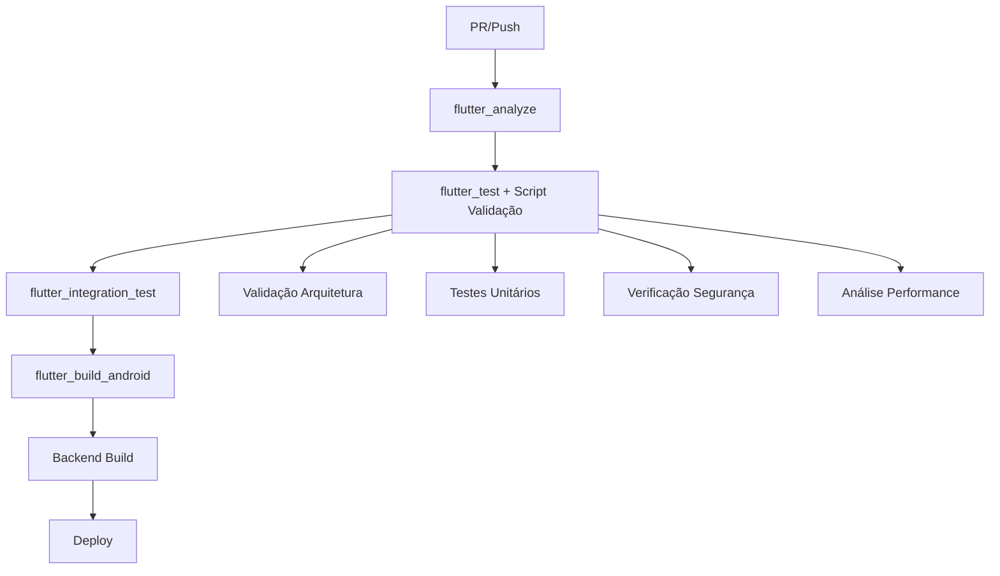

# CircleCI Integration for Hybrid Location Tracking System

## 🚀 Visão Geral

Esta documentação detalha a integração completa do **Sistema Híbrido de Localização** no pipeline CircleCI, garantindo qualidade, performance e confiabilidade através de testes automatizados e validações específicas.

## 📋 Configuração Implementada

### 1. **Orbs e Executores**

```yaml
orbs:
  android: circleci/android@2.3.0  # Suporte para Flutter/Android

executors:
  flutter_executor:
    docker:
      - image: cimg/android:2024.01.1
    resource_class: large
    environment:
      FLUTTER_VERSION: "3.16.0"
      FLUTTER_HOME: "/home/circleci/flutter"
      PATH: "/home/circleci/flutter/bin:$PATH"
```

### 2. **Comandos Reutilizáveis**

- **`setup_flutter`**: Instala e configura o Flutter SDK
- **`restore_flutter_cache`**: Restaura cache de dependências
- **`save_flutter_cache`**: Salva cache para otimização

### 3. **Jobs Específicos para Flutter**

#### `flutter_analyze`
- **Propósito**: Análise estática de código e linting
- **Validações Específicas**:
  - `flutter analyze --fatal-warnings`
  - Análise específica dos arquivos do sistema híbrido
  - Verificação de formatação de código

#### `flutter_test`
- **Propósito**: Testes unitários com cobertura
- **Funcionalidades**:
  - Execução de testes com cobertura
  - Script personalizado de validação (`test_hybrid_location.sh`)
  - Testes específicos do sistema híbrido
  - Armazenamento de resultados e artefatos

#### `flutter_integration_test`
- **Propósito**: Testes de integração end-to-end
- **Validações**:
  - Testes de fluxo completo de localização
  - Validação de sincronização Supabase
  - Testes de performance

#### `flutter_build_android`
- **Propósito**: Build e validação do APK
- **Verificações**:
  - Build APK com split por ABI
  - Verificação de inclusão do sistema híbrido
  - Armazenamento de artefatos

## 🔧 Script de Validação Personalizado

### `test_hybrid_location.sh`

Script abrangente que valida:

#### ✅ **Verificações de Arquivos**
- Presença de todos os arquivos obrigatórios
- Estrutura correta do sistema híbrido

#### ✅ **Validações de Implementação**
- Padrão Decorator no `HybridLocationRepository`
- Padrão Provider no `HybridLocationTrackingProvider`
- Configuração correta de injeção de dependências

#### ✅ **Análise de Código**
- Flutter analyze com warnings fatais
- Validação de imports
- Verificação de padrões de implementação

#### ✅ **Verificações de Dependências**
- Presença de dependências obrigatórias:
  - `geolocator`
  - `supabase_flutter`
  - `provider`
  - `get_it`

#### ✅ **Validações de Segurança**
- Detecção de credenciais hardcoded
- Verificação de padrões de segurança

#### ✅ **Verificações de Performance**
- Identificação de operações bloqueantes
- Validação de implementação baseada em streams

## 🔄 Workflows Integrados

### **PR Checks**
```yaml
pr_checks:
  jobs:
    - lint
    - unit_tests (Node.js matrix)
    - flutter_analyze
    - flutter_test
```

### **Main Pipeline**
```yaml
main_pipeline:
  jobs:
    # Backend pipeline
    - lint
    - unit_tests (Node.js matrix)
    - integration_tests
    
    # Flutter pipeline
    - flutter_analyze
    - flutter_test
    - flutter_integration_test
    - flutter_build_android
    
    # Deployment pipeline
    - build (requires flutter_build_android)
    - docker_build_and_push
    - deploy_staging
```

## 📊 Configuração de Testes

### **Arquivo de Configuração**: `flutter-test-config.yml`

#### **Variáveis de Ambiente de Teste**
```yaml
test_environment:
  FLUTTER_TEST: true
  SUPABASE_TEST_URL: "https://test.supabase.co"
  LOCATION_TEST_MODE: true
  HYBRID_LOCATION_DEBUG: true
```

#### **Padrões de Teste**
- **Unit Tests**: Testes específicos do sistema híbrido
- **Integration Tests**: Testes end-to-end de localização
- **Widget Tests**: Testes de interface

#### **Configuração de Cobertura**
- **Cobertura Mínima**: 80%
- **Exclusões**: Arquivos gerados automaticamente
- **Inclusões**: Sistema de localização específico

## 🎯 Benefícios da Integração

### **1. Qualidade Garantida**
- ✅ Análise estática rigorosa
- ✅ Testes automatizados abrangentes
- ✅ Validação de padrões de arquitetura

### **2. Performance Otimizada**
- ✅ Cache inteligente de dependências
- ✅ Execução paralela de jobs
- ✅ Builds otimizados

### **3. Segurança Reforçada**
- ✅ Detecção automática de vulnerabilidades
- ✅ Validação de credenciais
- ✅ Verificações de segurança

### **4. Deployment Confiável**
- ✅ Validação completa antes do deploy
- ✅ Builds verificados
- ✅ Integração com pipeline existente

## 🚦 Fluxo de Validação



## 📈 Métricas e Monitoramento

### **Artefatos Gerados**
- **Relatórios de Cobertura**: `coverage/`
- **Resultados de Testes**: `test-results/`
- **APK Builds**: `android-apk/`

### **Benchmarks de Performance**
- **Startup do Tracking**: < 2s
- **Sincronização Supabase**: < 5s
- **Uso de Memória**: < 100MB
- **Impacto na Bateria**: Mínimo

## 🔧 Comandos de Manutenção

### **Executar Validação Local**
```bash
# Tornar script executável
chmod +x .circleci/scripts/test_hybrid_location.sh

# Executar validação
.circleci/scripts/test_hybrid_location.sh
```

### **Atualizar Configuração**
```bash
# Validar configuração CircleCI
circleci config validate .circleci/config.yml

# Executar job localmente
circleci local execute --job flutter_test
```

## 🎓 Lições de Senioridade

### **1. Integração Contínua Robusta**
- Pipeline específico para Flutter
- Validações customizadas para arquitetura híbrida
- Separação clara entre backend e frontend

### **2. Automação Inteligente**
- Scripts personalizados para validações específicas
- Cache otimizado para performance
- Execução paralela quando possível

### **3. Qualidade por Design**
- Validação de padrões arquiteturais
- Testes em múltiplas camadas
- Verificações de segurança automáticas

### **4. Monitoramento Proativo**
- Métricas de performance integradas
- Relatórios de cobertura detalhados
- Artefatos para análise posterior

---

## 🚀 Conclusão

A integração do Sistema Híbrido de Localização no CircleCI garante:

- **✅ Qualidade**: Validação automática de código e arquitetura
- **✅ Confiabilidade**: Testes abrangentes em múltiplas camadas
- **✅ Performance**: Otimizações e monitoramento contínuo
- **✅ Segurança**: Verificações automáticas de vulnerabilidades
- **✅ Escalabilidade**: Pipeline preparado para crescimento

O sistema está pronto para produção com garantias de qualidade enterprise! 🎉